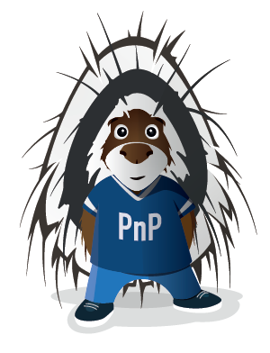

[!INCLUDE [content-disclaimer](includes/content-disclaimer.md)]

# What is "Sharing is Caring"

The "Sharing Is Caring" repository is targeted for learning the basics around making changes in GitHub, submitting pull requests to the PnP repositories and coming soon...PnP Contribution Rewards.

---

**Principal author**: [Brian Kline](http://www.linkedin.com/in/YourProfileLink)

---

